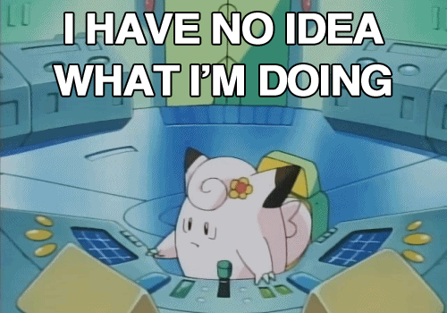
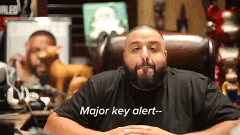

# Joshua Simpson

# Let's get down to business

I've been at Otto for roughly 5 months, with my previous job being at a consultancy called AND Digital. I'm a developer with a very generalist set of skills, skills ~~that make me a nightmare for people like you~~ ranging from Javascript and Ruby to tools and techniques that lie in the 'DevOps arena', and a handful of topics between.

I enjoy running events / hackathon type stuff, as well as giving talks that are more than 60% gifs. Anything that revolves around teaching / enabling generally makes me happy. Outside of work, I'm generally just a **massive** nerd (examples include Dungeons and Dragons) and/or at the pub.

# HBDI / Communication Styles

I'm pretty evenly matched in all four areas. This has it's benefits and drawbacks - I'm good at shifting, and am happy to flex into styles more comfortable with the people around me. It's also useful for making sure that I approach a problem from every angle 

**however** 

this also means that I jump styles a lot, and can make it difficult for me to make critical decisions quickly, which is something that I'm working on. 

When I'm stressed, I move more sharply into blue / red - mostly becoming super focused on getting something done without considering the how or why, but making sure that people come first 

# Ways of Working

- I'm much more effective at 11am than I am at 9am - always feel free to ask questions but early mornings... patience is key 🙏

- I hold very tightly to the mantra of 'work is your job, not your life'. This covers a lot of things, but most importantly for me covers potential burnout, as well as separation of work and life. Naturally whilst I preach it, I sometimes fail at practicing it, so _please_ let me know if that's the case 

- Always feel free to grab me ad-hoc for a chat or a question or feedback, but putting something in my calendar / something structured tends to yield better results 📈

- Meetings are great, so long as we've got a rough semblance of structure, and occasionally timeboxing - otherwise there's great potential for rabbit holes and bikeshedding

- I weirdly classify my availability for chats with my headphones - if I have small headphones (airpods etc) in, I'm available for any ad-hoc chat. If I have big over-ear headphones on, then throw me a Slack message first - I keep a close eye on it and if I'm **really** busy then I'll come back to you when I'm free. If it feels urgent to you, then *never* hesitate to come and speak to me

- I do tend to take on multiple things at once - I feel more comfortable when I've got a healthy amount of pressure and a few plates to balance. If you've got concerns then feel free to raise them with me 

# My current role

- Currently Tech Lead for Otto Car
  - I'm always looking for feedback, so let me know where I can improve
  - I enjoy the balance of hands on dev and the more 'concept-oriented' parts of my role, but most of all the people part
  - I really enjoy that we get to experiment with different ways of working and new processes as a team and cultivate a learning environment
  - I like enabling and effecting change
  - Safe psychological environments in which to build and grow are ✨
  - Whilst I'm only about 40% hands on developer nowadays, I enjoy pair programming and building around the critical path (fixing up frameworks, improving / covering technical debt, building out tooling to support developer work)

# Key Values

- Transparency - in work yes, but also to an extent in personal. If you're having a rough time or issues outside of work, I don't need to know what they are, that's your business, but I do *want* to know so that I can adjust accordingly. As somebody who isn't neurotypical, things like mental health / self care are super important to me
- Be excellent to each other - it should go without saying, but respect within any team I work in is absolute key to me, in all forms 
- Collaborative learning and teaching - spaces that enable learning and sharing are my favourite spaces. I love questions, especially if I don't know the answer
- Enabling and empowering others

# Here be dragons

A few pointers from feedback I've noted so far that I'm working on - I'd love feedback on how you think I'm managing these points:

- I have a penchant for silo'ing myself when I get into something, and this affects my visiblity and communication
- I have a tendency to speak before I think, which means I ramble and jump from point to point when explaining or talking through things. If I'm jumping too much between things when I'm talking then just let me know and bring me back to a focal point. 
- I run a lot of decisions off of gut instinct. This also means that sometimes I have an opinion on something but might not have the 'why' ready straight away. Give me a couple of minutes and I'll get there!
- I do a lot of context switching in my role. If you feel like I'm neglecting something, let me know so I can adjust where need be
